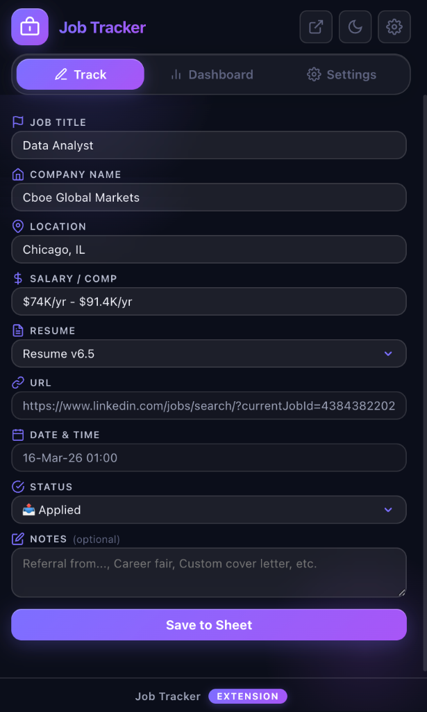
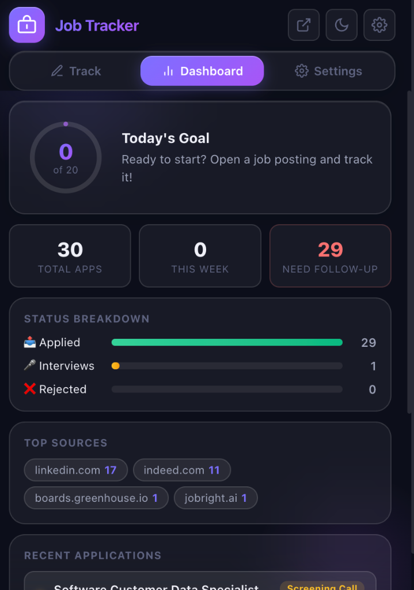
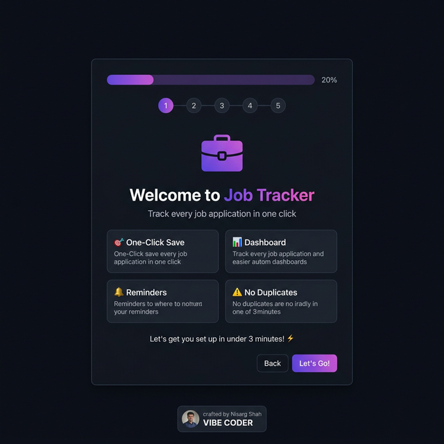

# 🧳 Job Application Tracker — Chrome Extension

### Never lose track of where you applied. Ever again.

[](https://chrome.google.com/webstore)
[](LICENSE)
[](https://github.com/nisarg-007)

---

**Job Application Tracker** is a **free, open-source Chrome extension** that saves your job applications to Google Sheets with a single click. No sign-ups, no subscriptions, no data collection — just you, your browser, and your own Google Sheet.

Built for job seekers who are tired of losing track of where they applied, which resume they used, and when to follow up.

> 💡 *"I applied to 200+ jobs and lost track after 20. This extension would have saved me weeks."*

---

## ✨ Features

| Feature | Description |
|---------|-------------|
| 🎯 **One-Click Save** | Auto-detects job title & company from LinkedIn, Indeed, Greenhouse, Lever, Workday, Glassdoor, and more |
| 📊 **Application Dashboard** | Track total applications, weekly stats, source breakdown, and likelihood analysis |
| 🎯 **Daily Goal Tracker** | Set daily application goals with an animated progress ring — stay motivated! |
| ⚠️ **Duplicate Detection** | Warns you if you've already tracked a job posting — no double applications |
| 🔔 **Follow-Up Reminders** | Badge appears when applications are 7+ days old — never forget to follow up |
| 📜 **Recent Applications** | Quick-view of your last 5 tracked apps right in the popup |
| 🧠 **Smart Resume Memory** | Type a custom resume name once — it automatically appears in the dropdown forever |
| 🧙 **Setup Wizard** | Beautiful 5-step onboarding walks you through everything on first install |
| 🔒 **100% Private** | Your data goes to YOUR Google Sheet. No servers, no tracking, no ads |

---

## 📸 Screenshots

<p align="center">
  
  &nbsp;&nbsp;&nbsp;
  
  &nbsp;&nbsp;&nbsp;
  
</p>

---

## 🚀 Quick Start (3 Minutes!)

### Step 1: Install the Extension
**Option A — Chrome Web Store** *(coming soon)*:
Search "Job Application Tracker" or [click here](#) to install.

**Option B — Load Unpacked** (developers):
1. Clone this repo: `git clone https://github.com/nisarg-007/job-application-tracker.git`
2. Open `chrome://extensions` in Chrome
3. Enable **Developer mode** (toggle top-right)
4. Click **"Load unpacked"** → select the cloned folder

### Step 2: Set Up Your Google Sheet
When you first install, the **Setup Wizard** opens automatically and walks you through:

1. 📝 Creating a Google Sheet with the right columns
2. 📋 Copying the backend script (one-click copy!)
3. 🔗 Pasting your Web App URL
4. 🎯 Setting your daily application goal

**That's it.** You're ready to track.

### Step 3: Start Tracking!
1. Navigate to any job posting (LinkedIn, Indeed, etc.)
2. Click the extension icon
3. Review the auto-detected info
4. Hit **"Save to Sheet"**
5. Check your Google Sheet — new row added! ✨

---

## 📊 Google Sheet Columns

Each tracked application creates a row with these columns:

| Column | Example |
|--------|---------|
| Timestamp | 2026-03-08T19:30:00Z |
| Application Date | 2026-03-08 |
| Job Title | Senior Software Engineer |
| Company Name | Google |
| URL | https://careers.google.com/jobs/... |
| Location | Remote |
| Salary | $120k - $150k |
| Resume Used | Software Engineer Resume |
| Likelihood | Medium |
| Source | careers.google.com |
| Status | Applied |
| Notes | *(empty — fill in manually if needed)* |

---

## 🔧 Supported Job Sites

Works on **any website**, with smart detection for:

| Site | Auto-Detect Title | Auto-Detect Company |
|------|:-----------------:|:-------------------:|
| LinkedIn | ✅ | ✅ |
| Indeed | ✅ | ✅ |
| Greenhouse | ✅ | ✅ |
| Lever | ✅ | ✅ |
| Workday | ✅ | ✅ |
| Glassdoor | ✅ | ✅ |
| **Any other site** | Falls back to `<h1>` / page title | Falls back to meta tags |

> 💡 On unsupported sites, the title and company fields are fully editable — just type them in!

---

## 🏗️ Architecture

```
📁 Job Application Tracker
├── manifest.json          # Chrome MV3 configuration
├── config.js              # Resume options + fallback Web App URL
├── popup.html             # Extension popup (Track + Dashboard tabs)
├── popup.css              # Premium dark theme styling
├── popup.js               # Popup logic: scraping, form, dashboard
├── content_script.js      # DOM scraper for job sites
├── background.js          # Service worker: history, stats, badges
├── welcome.html           # 5-step onboarding wizard
├── welcome.css            # Wizard styling
├── welcome.js             # Wizard logic + Apps Script copy
├── google_apps_script.js  # Backend code (paste into Apps Script)
├── PRIVACY_POLICY.md      # Privacy policy
├── icons/                 # Extension icons (16, 48, 128px)
└── screenshots/           # Store listing screenshots
```

### Data Flow

```
Job Posting Page → Content Script (scrapes) → Popup (form)
                                                    ↓
                                              User clicks Save
                                                    ↓
                                    POST JSON → Google Apps Script
                                                    ↓
                                            Your Google Sheet ✅
```

- **No middle servers** — data goes directly from your browser to your Google Sheet
- **Local storage** — dashboard stats and history stored in your browser only
- **No accounts** — no sign-up, no login, no email required

---

## 🔒 Privacy & Security

- ✅ **Open source** — read every line of code yourself
- ✅ **No servers** — we don't operate any backend infrastructure
- ✅ **No tracking** — zero analytics, zero telemetry, zero ads
- ✅ **No data collection** — your applications stay between your browser and your Google Sheet
- ✅ **Minimal permissions** — only `activeTab`, `scripting`, `storage`, `alarms`
- ✅ **Full privacy policy** — see [PRIVACY_POLICY.md](PRIVACY_POLICY.md)

---

## 🎨 Customization

### Change Resume Options
Edit `config.js` to set your default resume dropdown:
```javascript
RESUME_OPTIONS: [
  "Software Engineer Resume",
  "Data Analyst Resume",
  "Product Manager Resume",
]
```
Or just type a custom name — it'll be remembered automatically!

### Change Daily Goal
Re-open the Setup Wizard (click ⚙ in the popup) to change your daily goal.

### Change Follow-Up Period
Edit `background.js` and change `7` (days) to any number you want.

### Change Theme Colors
Edit the CSS variables in `popup.css` `:root` to match your style.

---

## 🤝 Contributing

Contributions are welcome! Here's how:

1. Fork this repo
2. Create a branch: `git checkout -b feature/my-feature`
3. Make your changes
4. Push: `git push origin feature/my-feature`
5. Open a Pull Request

### Ideas for Contributions
- [ ] Add more job site selectors (e.g., ZipRecruiter, AngelList)
- [ ] Export application history as CSV
- [ ] Dark/Light theme toggle
- [ ] Application status tracking (Applied → Interview → Offer)
- [ ] Chrome Web Store review prompt
- [ ] Localization (i18n)

---

## 📝 Changelog

### v2.0.0 — March 2026
- ✨ First-time setup wizard with 5-step onboarding
- 📊 Dashboard tab with daily goal ring, stats, and charts
- ⚠️ Duplicate URL detection
- 🔔 Follow-up reminder badges
- 📜 Recent applications list
- 🧠 Smart resume memory (custom names auto-saved)
- 🏷️ Creator branding

### v1.0.0 — March 2026
- 🎯 Core tracking: auto-detect job title & company
- 📋 Google Sheets integration via Apps Script
- 🎨 Premium dark-themed popup UI

---

## 📜 License

This project is licensed under the **MIT License** — see the [LICENSE](LICENSE) file for details.

Free to use, modify, and distribute. If you find it useful, star ⭐ this repo!

---

## 👨‍💻 Author

**Nisarg Shah** — *Vibe Coder*

- GitHub: [@nisarg-007](https://github.com/nisarg-007)

---

<p align="center">
  <strong>If this extension helped you land a job, give it a ⭐!</strong><br/>
  <sub>Built with ❤️ for every job seeker out there.</sub>
</p>
